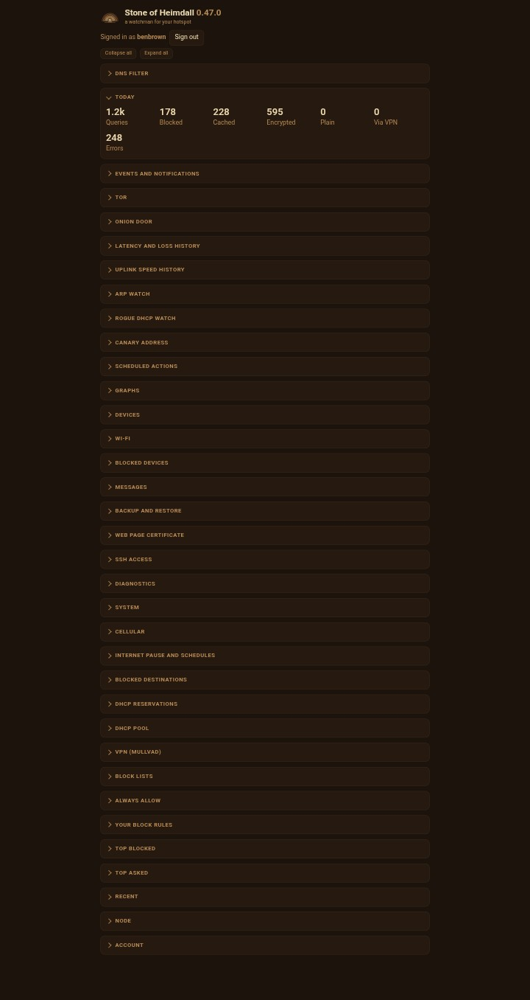

# Stone of Heimdall
### a watchman for your hotspot

**A privacy firmware layer for the Orbic RC400L cellular hotspot.** It scrambles what trackers, ad networks and your carrier's resolver can see of your unprivate web traffic: it filters DNS, forces encrypted DNS, sends chosen devices through a VPN, closes IPv6 and WebRTC address leaks, and blocks outbound services you have not approved.

**It watches before it guards.** A fresh install only reports what your devices tried to reach (the "would be refused" list), and you decide what to allow before anything is enforced.

"Orbic" is the trademark of its owner and appears here only to say which hardware this runs on. This project is not affiliated with or endorsed by Orbic or any carrier.

## What it does
Tested on one unit; see ["Check it yourself"](docs/INSTALL.md#check-it-yourself) in `docs/INSTALL.md` to verify each one on yours.
- All DNS leaves encrypted (DoH), or through the VPN or Tor. Plain DNS and DNS-over-TLS are refused at the router.
- A DNS filter with a catalog of block lists, your own wildcard rules, per-device profiles and a "why was this blocked?" box.
- Per-device exits: direct, Mullvad (WireGuard, with a kill switch), or Tor. Device IPv6 addresses cannot leak around the tunnel.
- **Default-deny outbound:** a fresh install blocks every outbound connection except the services you tick (web, QUIC, clock sync, ssh, email, push notifications on by default; calls, consoles, VPNs, torrents, remote desktop, MQTT/IRC off) and ports you add, globally or per device. A watch-only mode shows what would be refused before you enforce it. DNS is always handled by the router, never by a device's own choice.
- Carrier firmware-update engines kept suspended.
- A single-page web UI with collapsible cards. No telemetry. Nothing leaves the house unless you configure it.

## What it does not do
- It is not anonymity. Your carrier still knows where your hotspot is and sees connection metadata. The VPN provider sees what the carrier otherwise would.
- It cannot see inside encrypted traffic and does not try to.
- It has been tested on **one unit** of one model on one carrier. Rooting the hotspot may void its warranty or breach the carrier's terms, and reading some flash partitions can freeze the device until a power cycle. You are responsible for your own hardware.

## First install
**Experimental and untested from a factory-fresh unit.** `install/stone-install` installs over the USB cable with questions in the terminal, journals every change and rolls back on failure. Its pieces were tested separately, but the whole path has not yet been run from a stock unit. Read ["First install"](docs/INSTALL.md#first-install-experimental-untested-on-a-factory-fresh-unit) in `docs/INSTALL.md` before you try it. Updating, signing in and configuring a unit that already runs it are documented there too.

## How it was made
Written by Claude, an AI model made by Anthropic, under the direction of the project's maintainer, who set the goals and decisions and tested it on their own hardware. The maintainer did not write or line-by-line audit the code. It has a large automated test suite and one real unit's worth of use. Read it before you trust it with anything that matters.

## Status
Early, and a **source release** for now: the install guide is in [`docs/`](docs/); the first-install tool is experimental and untested from a stock unit, so expect to read the code. Licensed under the [MIT license](LICENSE); third-party programs it installs (dnsmasq, dropbear, Tor) are fetched from their own sources and keep their own licenses.

## More
- [`docs/SECURITY.md`](docs/SECURITY.md) — how to report a vulnerability
- [`docs/THREAT-MODEL.md`](docs/THREAT-MODEL.md) — what it defends against, and what it does not
